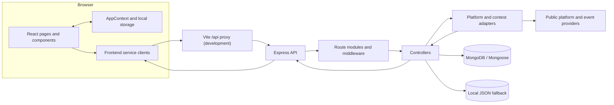

# System architecture

```mermaid
flowchart LR
  subgraph Browser["Browser"]
    UI["React pages and components"]
    State["AppContext and local storage"]
    Client["Frontend service clients"]
    UI <--> State
    UI --> Client
  end

  Proxy["Vite /api proxy (development)"]
  API["Express API"]
  Routes["Route modules and middleware"]
  Controllers["Controllers"]
  Adapters["Platform and contest adapters"]
  Mongo[("MongoDB / Mongoose")]
  Fallback[("Local JSON fallback")]
  Providers["Public platform and event providers"]

  Client --> Proxy --> API --> Routes --> Controllers
  Controllers --> Mongo
  Controllers --> Fallback
  Controllers --> Adapters --> Providers
  Adapters --> Controllers
  Controllers --> API --> Client
```
