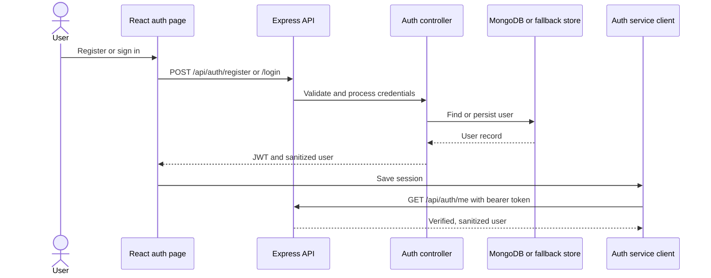

# Authentication flow

```mermaid
sequenceDiagram
  actor User
  participant UI as React auth page
  participant API as Express API
  participant Auth as Auth controller
  participant Store as MongoDB or fallback store
  participant Client as Auth service client

  User->>UI: Register or sign in
  UI->>API: POST /api/auth/register or /login
  API->>Auth: Validate and process credentials
  Auth->>Store: Find or persist user
  Store-->>Auth: User record
  Auth-->>UI: JWT and sanitized user
  UI->>Client: Save session
  Client->>API: GET /api/auth/me with bearer token
  API-->>Client: Verified, sanitized user
```
