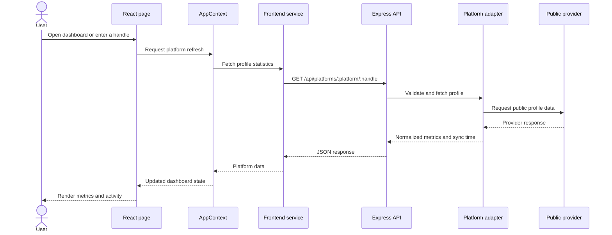

# Data flow

```mermaid
sequenceDiagram
  actor User
  participant Page as React page
  participant Context as AppContext
  participant Client as Frontend service
  participant API as Express API
  participant Adapter as Platform adapter
  participant Provider as Public provider

  User->>Page: Open dashboard or enter a handle
  Page->>Context: Request platform refresh
  Context->>Client: Fetch profile statistics
  Client->>API: GET /api/platforms/:platform/:handle
  API->>Adapter: Validate and fetch profile
  Adapter->>Provider: Request public profile data
  Provider-->>Adapter: Provider response
  Adapter-->>API: Normalized metrics and sync time
  API-->>Client: JSON response
  Client-->>Context: Platform data
  Context-->>Page: Updated dashboard state
  Page-->>User: Render metrics and activity
```
