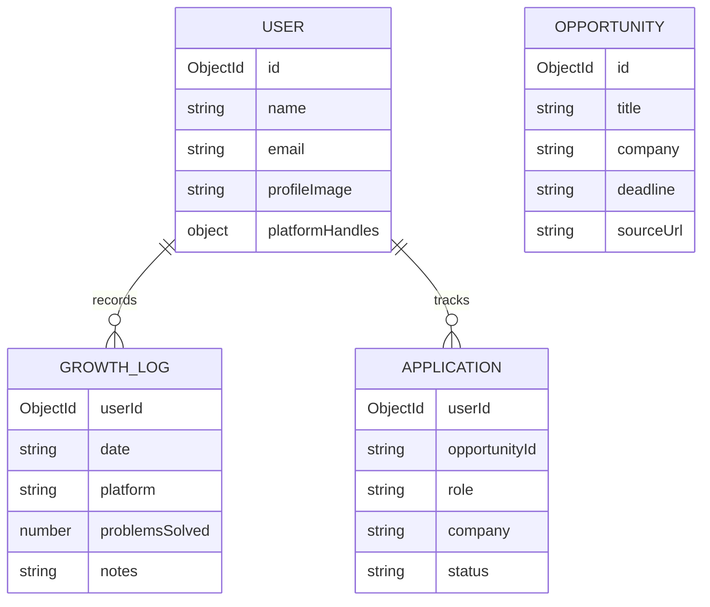

# Database entity relationships

```mermaid
erDiagram
  USER ||--o{ GROWTH_LOG : records
  USER ||--o{ APPLICATION : tracks

  USER {
    ObjectId id
    string name
    string email
    string profileImage
    object platformHandles
  }
  GROWTH_LOG {
    ObjectId userId
    string date
    string platform
    number problemsSolved
    string notes
  }
  OPPORTUNITY {
    ObjectId id
    string title
    string company
    string deadline
    string sourceUrl
  }
  APPLICATION {
    ObjectId userId
    string opportunityId
    string role
    string company
    string status
  }
```

`GrowthLog.userId` and `Application.userId` reference `User`. `Application.opportunityId` is a string field and is not a Mongoose reference to `Opportunity`.
