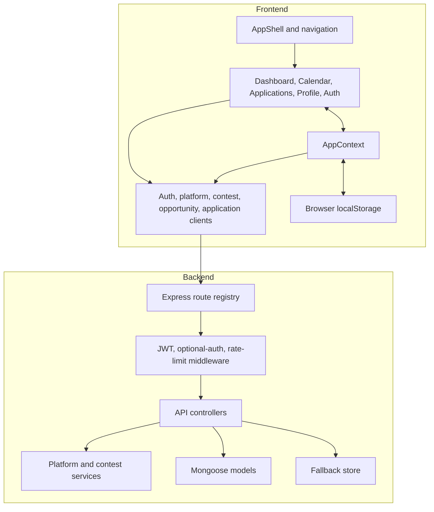

# Module interaction

```mermaid
flowchart TB
  subgraph Frontend["Frontend"]
    Shell["AppShell and navigation"]
    Pages["Dashboard, Calendar, Applications, Profile, Auth"]
    Context["AppContext"]
    Services["Auth, platform, contest, opportunity, application clients"]
    Storage["Browser localStorage"]
    Shell --> Pages
    Pages <--> Context
    Context <--> Storage
    Pages --> Services
    Context --> Services
  end

  subgraph Backend["Backend"]
    Router["Express route registry"]
    Middleware["JWT, optional-auth, rate-limit middleware"]
    Controllers["API controllers"]
    PlatformServices["Platform and contest services"]
    Models["Mongoose models"]
    Fallback["Fallback store"]
    Router --> Middleware --> Controllers
    Controllers --> PlatformServices
    Controllers --> Models
    Controllers --> Fallback
  end

  Services --> Router
```
