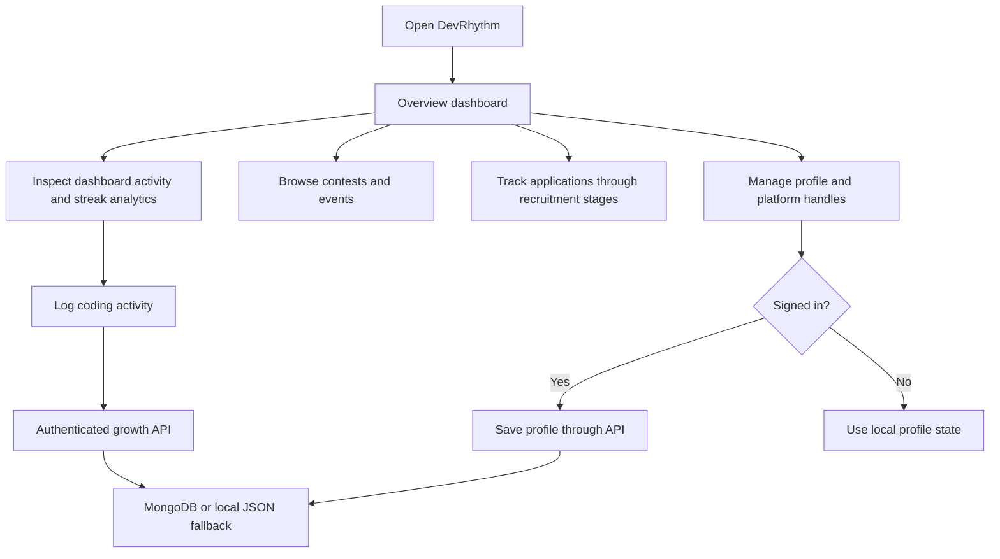

# Application workflow

```mermaid
flowchart TD
  Start["Open DevRhythm"] --> Overview["Overview dashboard"]
  Overview --> Analytics["Inspect dashboard activity and streak analytics"]
  Overview --> Calendar["Browse contests and events"]
  Overview --> Career["Track applications through recruitment stages"]
  Overview --> Profile["Manage profile and platform handles"]
  Analytics --> Log["Log coding activity"]
  Log --> GrowthAPI["Authenticated growth API"]
  GrowthAPI --> Store["MongoDB or local JSON fallback"]
  Profile --> Auth{"Signed in?"}
  Auth -->|Yes| Update["Save profile through API"]
  Auth -->|No| Local["Use local profile state"]
  Update --> Store
```
